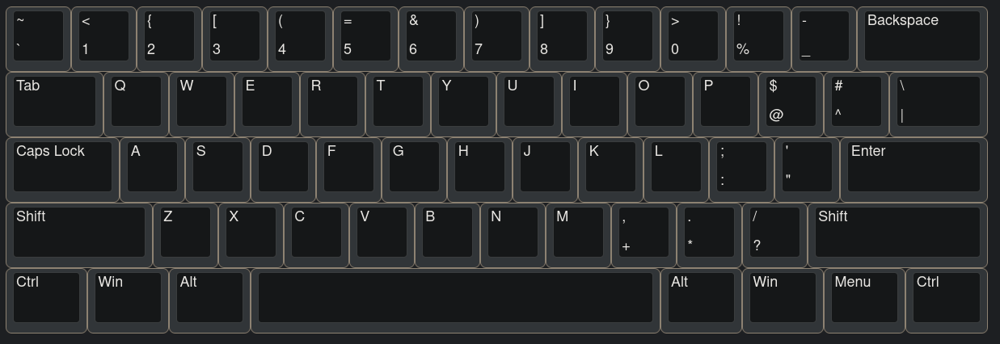

# Programmer QWERTY Keyboard Layout

A custom keyboard layout optimized for programming with symbols on the number row (ThePrimeagen-style) and QWERTY base.



## Features

- **Number row**: Symbols on base layer, numbers on shift
  - `1` → `+`, `Shift+1` → `1`
  - `2` → `[`, `Shift+2` → `2`
  - `3` → `{`, `Shift+3` → `3`
  - And so on...
- **Bracket keys**: Repurposed for `<` and `>`
- **Standard positions**: `;`, `-`, `=` remain in normal locations
- **Hyprland compatible**: Workspace switching with `ALT+1` works correctly

## Installation

The layout is installed as a system-wide XKB keyboard layout:

```bash
# Install the layout
sudo cp ~/.dotfiles/extras/keyboard/xkb/programmer /usr/share/X11/xkb/symbols/
sudo chmod 644 /usr/share/X11/xkb/symbols/programmer

# Enable in Hyprland (already configured in input.lua)
# hl.config({ input = { kb_layout = "programmer,us" } })
```

Then run `hyprctl reload` and check `hyprctl configerrors`.

## Workspace Bindings

With this setup, your workspace bindings work as expected:
- `ALT + 1` → Workspace 1 (types `+` in editors)
- `ALT + 2` → Workspace 2 (types `[` in editors)
- `ALT + SHIFT + 1` → Move window to workspace 1
- `SUPER + 1` → Workspace 1 (Omarchy default)

## Files

- `keyboard.png` - Visual reference of the layout
- `xkb/programmer` - XKB layout definition
- `XKB.md` - Detailed XKB setup and uninstall instructions
- `keyd/` - Legacy keyd configuration (not used with Hyprland)

## Resources

- ThePrimeagen's original: https://github.com/ThePrimeagen/keyboards
- ThePrimeagen's dev config: https://github.com/ThePrimeagen/dev/tree/master/env/.config/xkb
