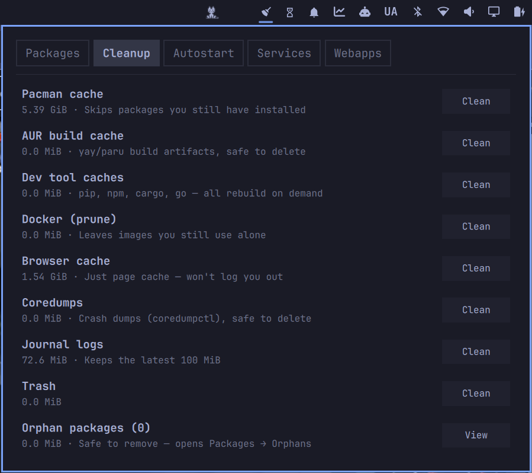

# System Tidy — system cleanup for Omarchy

A bar widget for [Omarchy](https://github.com/basecamp/omarchy) that shows
what's cluttering your system and lets you clean it in one panel.



Click the broom in the bar:

- **Packages** — everything installed beyond Omarchy's defaults, with size,
  install date, and last-used time. Toggle **Orphans** for packages nothing
  depends on anymore, or **Pacnew** for `.pacnew`/`.pacsave`/`.pacorig`
  leftovers pacman drops under `/etc` on upgrade. Removal is `pacman -Rns`
  (only that package's own deps go with it), snapshotted via `snapper`
  first when it's set up.
- **Cleanup** — pacman cache, AUR build cache (yay/paru), dev tool caches
  (pip/npm/cargo/go), Docker (`prune -f`, no `-a` — images you use stay),
  browser cache, coredumps, journal logs, trash, plus an orphan-packages
  summary linking back to Packages.
- **Startup** — what starts automatically, one-click disable. **Autostart**
  chip covers user + system `.desktop` entries; **Services** covers systemd
  `--user` units you (or something you installed) enabled yourself — scoped
  to `~/.config/systemd/user/` only, so vendor-shipped session units (audio,
  keyring, etc.) never show up here and there's nothing to break.
- **Webapps** — launchers from `omarchy webapp install`, one-click remove.

Status line shows Done/Failed for a couple seconds after every action.

## Requirements

Stock Omarchy plus `pacman-contrib`. Package removal, pacnew cleanup,
pacman cache trim, coredump, and journal cleanup ask for your password
(`pkexec`); everything else runs as your own user.

## Install

```bash
omarchy plugin add https://github.com/Loafer19/omarchy-system-tidy --enable
```

## Uninstall

```bash
omarchy plugin remove yoyo.system-tidy
```
